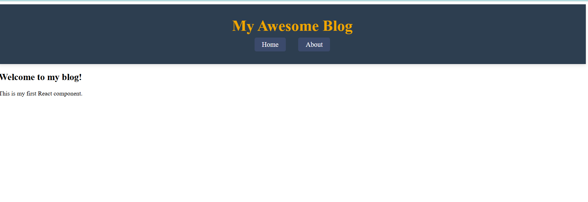

Assignment 0

## Project Structure
react-blog/
├── .gitignore               
├── README.md                
├── package.json          
├── vite.config.js         
└── src/
    ├── components/      
    │   └── Header.jsx      
    ├── App.jsx           
    ├── main.jsx          
    └── index.css         

## Screenshot

## What I Learned
in this i have learned about react and vite 
1.learned about components are block of code which is used to make a single page application faster to render the data compared to html 
2.learned how to add a css for the components for each components
3.Learning the JSX syntax used in React, which combines JavaScript and HTML-like code for rendering UI elements.

Assignment1

##Components Struture

1. BlogPost: in this component represents an individual blog post. it will display the title,author,date, read time and content of single post.

2. BlogList: This component acts as a container for multiple BlogPost components. It receives an array of posts as props and maps through them to render each individual blog post.

3.Header: the component is use to navigation and displaying the site title.

##styling Approach

 I used CSS Modules, which helps keep the styles separate for each component. This means that the styles are specific to each part of the app and won’t mix with other components, making the code easier to manage.

 ##New Features

1.created a blog post component that dynamically displays the blog post details
2.created a blog list component that render a list of posts dynamically for the array of posts

3.created a posts in that which contains the post infromation.

##screenshots

Desktop view:
(<Screenshot 2024-11-13 214602.png>)

Mobile view:

(<Screenshot 2024-11-13 214818.png>)